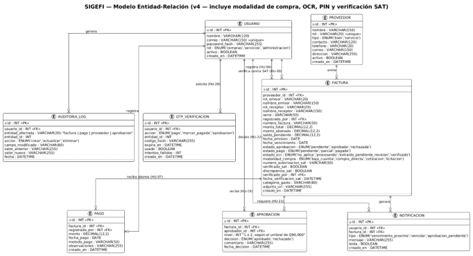

# Documentación de decisiones de análisis

**SIGEFI — Sistema de Gestión Financiera Municipal**

## Objetivo y criterio de consolidación

Dejar constancia de las decisiones tomadas durante el análisis de SIGEFI y mantenerlas consistentes con los artefactos más actualizados del proyecto. Esta versión corrige contradicciones e incorpora modalidad de compra, verificación manual contra SAT, PIN de seguridad y la entidad OTP_VERIFICACION.

## Regla de precedencia documental utilizada

Para reglas operativas nuevas o modificadas se priorizan el Diccionario de Datos v3.1, el Modelo ER v4 y los diagramas de casos de uso corregidos.

El Acta y las Historias de Usuario conservan el alcance base, salvo cuando un artefacto posterior introduce una excepción explícita o una regla más específica.

La versión anterior del registro se usa como línea base; cualquier conflicto con artefactos posteriores se corrige y se documenta.

La integración automática con SAT continúa fuera del alcance. La verificación SAT incluida es manual y registrada por Administración/Gerencia.

## Fuentes consolidadas

| **Código** | **Fuente**                                                | **Uso**                                                     |
|------------|-----------------------------------------------------------|-------------------------------------------------------------|
| **F-01**   | Acta Constitucion SIGEFI (1).docx                         | Alcance, objetivos, roles, stack, PWA y exclusiones.        |
| **F-02**   | Historiasde Usuario - SIGEFI (1).docx                     | HU-01 a HU-26, RF-01 a RF-59 y RNF-01 a RNF-12.             |
| **F-03**   | 2.2 - Diccionario de Datos (v3.1).docx                    | Modelo lógico, modalidad, SAT, PIN/OTP y reglas de negocio. |
| **F-04**   | 2.2 - Modelo-ER.png (v4)                                  | Modelo actualizado con ocho entidades.                      |
| **F-05**   | CORRECCION 2_ SIGEFI - Diagramas de Casos de Uso (3).pdf | Diez diagramas corregidos; modalidad, SAT y PIN.            |
| **F-06**   | 2.3 mockups de pantallas principales por rol SIGEFI.docx  | Pantallas por los tres roles y prototipos Figma.            |
| **F-07**   | Minutas SIGEFI - Semanas1-3.docx                          | Acuerdos de análisis/diseño y stack final.                  |
| **F-08**   | Documento_Decisiones_Analisis_SIGEFI.docx.pdf             | Línea base del registro anterior.                           |

## 1. Resumen de decisiones consolidadas

| **Código** | **Fecha/origen** | **Tema**            | **Decisión resumida**                                                                                    | **Estado**            |
|------------|------------------|---------------------|----------------------------------------------------------------------------------------------------------|-----------------------|
| **DA-01**  | 21/07/2026       | Alcance y prioridad | Prototipo funcional; priorizar funciones núcleo estables.                                                | Confirmada            |
| **DA-02**  | 21/07/2026       | Actores y acceso    | Tres roles; separación Bienes/Servicios y vista consolidada.                                             | Confirmada            |
| **DA-03**  | 21/07/2026       | Proveedores         | Alta manual, clasificación obligatoria, edición y baja lógica.                                           | Confirmada            |
| **DA-04**  | 27/08/2026       | Facturación         | Semáforo por días restantes; edición solo si no aprobada y sin pagos.                                    | Confirmada            |
| **DA-05**  | 27/08/2026       | Pagos y saldos      | Pago/abono con saldo automático; exige factura habilitada y PIN.                                         | Confirmada            |
| **DA-06**  | 27/08/2026       | Aprobación          | Baja Cuantía autoaprobada; demás modalidades: 1/2 aprobaciones por Q90,000, PIN y aprobadores distintos. | Confirmada            |
| **DA-07**  | 21/07/2026       | Reportes            | Consolidado, vencimientos                                                                                | Confirmada            |
| **DA-08**  | 21/07/2026       | Auditoría/alertas   | Auditoría inmutable y notificaciones persistentes.                                                       | Confirmada            |
| **DA-09**  | 27/08/2026       | OCR                 | Extracción editable, confirmación humana y selección de modalidad.                                       | Actualizada           |
| **DA-10**  | 27/08/2026       | Modelo de datos     | Ocho entidades; se agrega OTP_VERIFICACION.                                                              | Confirmada            |
| **DA-11**  | 27/08/2026       | Integridad          | Estados separados, rol ENUM, SAT/PIN y restricciones.                                                    | Confirmada            |
| **DA-12**  | 07/08/2026       | Arquitectura        | React/TS/PWA, Node/Express/TS, MySQL/Prisma, JWT.                                                        | Confirmada            |
| **DA-13**  | 27/08/2026       | Mockups             | Cobertura por rol; más amplia que los diez wireframes previos.                                           | Confirmada            |
| **DA-14**  | 27/08/2026       | Exclusiones         | Sin integración SAT automática; sí verificación manual.                                                  | Confirmada            |
| **DA-15**  | 07/08/2026       | QA                  | QA continuo por sprint y regresión.                                                                      | Confirmada            |
| **DA-16**  | 07/08/2026       | Pruebas             | 63 casos iniciales; ampliar a nuevas reglas.                                                             | Confirmada            |
| **DA-17**  | 27/08/2026       | Modalidad de compra | Baja Cuantía, Compra Directa, Cotización o Licitación.                                                   | Confirmada            |
| **DA-18**  | 27/08/2026       | PIN                 | PIN temporal, hash, 10 min, un uso, 3 intentos.                                                          | Confirmada            |
| **DA-19**  | 27/08/2026       | SAT                 | Verificación manual previa a aprobación; discrepancia bloquea.                                           | Confirmada            |
| **DA-20**  | 27/08/2026       | Sincronización HU   | HU-27..HU-30 son referenciadas, pero no están en el archivo de Historias adjunto.                        | Corrección documental |

## 2. Registro detallado de decisiones

### DA-01: Alcance y prioridad

**Fecha / origen:** 21/07/2026

**Participantes o responsables:** Equipo SIGEFI

**Decisión:** Desarrollar un prototipo funcional de cuentas por pagar y análisis financiero para la Municipalidad de Chiquimulilla y priorizar el núcleo estable antes de agregar funciones nuevas.

**Justificación:** La MCI y el tiempo del semestre exigen un flujo integral y demostrable.

**Impacto y consecuencias:** Planificación y pruebas priorizan proveedores, facturas, pagos, saldos, vencimientos, aprobaciones, reportes, auditoría y notificaciones.

**Trazabilidad:** F-01; F-07.

**Estado:** Confirmada

### DA-02: Actores y control de acceso

**Fecha / origen:** 21/07/2026

**Participantes o responsables:** Equipo SIGEFI

**Decisión:** Mantener tres roles: Compras, Servicios y Administración/Gerencia. Compras opera Bienes, Servicios opera Servicios y Administración ve información consolidada y ejecuta funciones financieras/de control.

**Justificación:** Segregación de responsabilidades y mínimo acceso necesario.

**Impacto y consecuencias:** La autorización debe validarse tanto en interfaz como backend. El Diccionario v3.1 define rol como ENUM en USUARIO.

**Trazabilidad:** F-01; F-02 HU-13..HU-16/RF-01..RF-05; F-03; F-05.

**Estado:** Confirmada

### DA-03: Gestión de proveedores

**Fecha / origen:** 21/07/2026

**Participantes o responsables:** Equipo SIGEFI

**Decisión:** Registrar proveedores manualmente, clasificar Bien/Servicio, consultar, buscar, editar, desactivar y reactivar sin borrar historial.

**Justificación:** La clasificación controla acceso y la baja lógica conserva trazabilidad.

**Impacto y consecuencias:** NIT único, tipo obligatorio y campo activo.

**Trazabilidad:** F-02 HU-01..HU-03/RF-06..RF-12; F-03; F-05; F-06.

**Estado:** Confirmada

### DA-04: Facturación, semáforo y edición

**Fecha / origen:** 27/08/2026;

**Participantes o responsables:** Equipo SIGEFI

**Decisión:** Calcular semáforo por días restantes: verde >30, amarillo 15-30, rojo <15. Mantener antigüedad de vencidas como vista separada. Editar factura solo si todavía no está aprobada y no tiene pagos.

**Justificación:** Se separa prioridad de vencimiento del análisis de atraso y se preserva integridad tras autorización o pago.

**Impacto y consecuencias:** Cálculo dinámico; alternador próximas a vencer / antigüedad; bloqueo de edición tras aprobación o existencia de PAGO.

**Actualización / precedencia:** Amplía la regla anterior con la restricción explícita del caso de uso corregido.

**Trazabilidad:** F-02 HU-04/HU-05/HU-05b; F-03; F-05.

**Estado:** Confirmada

### DA-05: Pagos, abonos y saldos

**Fecha / origen:** 27/08/2026;

**Participantes o responsables:** Equipo SIGEFI

**Decisión:** Permitir pago total y abono parcial; recalcular monto_abonado, saldo_pendiente y estado_pago. No aceptar monto mayor al saldo. Registrar pago o marcar pagada solo con factura habilitada y PIN válido.

**Justificación:** Evita saldos negativos y acciones sensibles sin confirmación.

**Impacto y consecuencias:** PAGO guarda monto, fecha, método, observaciones y usuario; estado pasa pendiente/parcial/pagada.

**Trazabilidad:** F-02 HU-06..HU-08; F-03 PAGO/OTP; F-05 financiero.

**Estado:** Confirmada

### DA-06: Aprobación multinivel

**Fecha / origen:** 27/08/2026;

**Participantes o responsables:** Equipo SIGEFI

**Decisión:** Baja Cuantía queda aprobada automáticamente y no entra a la bandeja. Compra Directa, Cotización y Licitación sí requieren aprobación: <Q90,000 = 1; >=Q90,000 = 2 aprobaciones de usuarios distintos de Administración/Gerencia. Aprobar/rechazar exige PIN.

**Justificación:** La modalidad determina el control previo y el umbral mantiene segregación por nivel.

**Impacto y consecuencias:** APROBACION conserva nivel, decisión, comentario, usuario y fecha; no se permite el mismo aprobador en ambos niveles.

**Actualización / precedencia:** La excepción Baja Cuantía prevalece sobre HU-21/RF-45 y DA-06 anterior.

**Trazabilidad:** F-02 HU-21..HU-24 (base); F-03; F-05.

**Estado:** Confirmada

### DA-07: Reportes y análisis

**Fecha / origen:** 21/07/2026

**Participantes o responsables:** Equipo SIGEFI

**Decisión:** Entregar reportes consolidado, vencimientos e historial de pagos, filtrables y exportables a PDF/Excel.

**Justificación:** Apoyo a planificación y comunicación financiera.

**Impacto y consecuencias:** Administración/Gerencia dispone de panel consolidado y exportación.

**Trazabilidad:** F-01; F-02 HU-09/HU-10/RF-30b..RF-36; F-05; F-06.

**Estado:** Confirmada

### DA-08: Auditoría y notificaciones

**Fecha / origen:** 21/07/2026

**Participantes o responsables:** Equipo SIGEFI

**Decisión:** Auditar de forma inmutable cambios en facturas, pagos, aprobaciones y proveedores; generar notificaciones por vencimiento y aprobación pendiente con estado leída/no leída.

**Justificación:** Trazabilidad y alertas oportunas.

**Impacto y consecuencias:** AUDITORIA_LOG es de solo escritura; NOTIFICACION registra usuario, factura opcional, tipo, mensaje, leída y fecha.

**Trazabilidad:** F-02 HU-17..HU-20/RF-37..RF-44; F-03; F-05; F-06.

**Estado:** Confirmada

### DA-09: Captura OCR

**Fecha / origen:** 27/08/2026;

**Participantes o responsables:** Equipo SIGEFI

**Decisión:** Aceptar JPG/PNG/PDF, extraer datos, mostrarlos prellenados y editables, permitir corrección/completado y guardar solo tras confirmación humana. Permitir cancelar a registro manual. Incluir selección de modalidad antes del guardado.

**Justificación:** Acelera captura sin persistir errores del OCR.

**Impacto y consecuencias:** FACTURA usa estado_ocr y adjunto_url; la procedencia manual/OCR queda trazada.

**Trazabilidad:** F-02 HU-25/HU-26/RF-53..RF-59; F-03; F-05; F-06.

**Estado:** Confirmada

### DA-10: Modelo de datos definitivo

**Fecha / origen:** 27/08/2026; actualizado a v4

**Participantes o responsables:** Equipo técnico

**Decisión:** Adoptar ocho entidades: USUARIO, PROVEEDOR, FACTURA, PAGO, APROBACION, NOTIFICACION, AUDITORIA_LOG y OTP_VERIFICACION. OCR permanece como atributos de FACTURA.

**Justificación:** OTP es necesario para seguridad de operaciones sensibles.

**Impacto y consecuencias:** Prisma/MySQL deben reflejar OTP y los nuevos campos de modalidad/SAT en FACTURA.

**Actualización / precedencia:** Sustituye la decisión anterior de siete entidades.

**Trazabilidad:** F-03; F-04; F-05.

**Estado:** Actualizada

### DA-11: Integridad y estados

**Fecha / origen:** 27/08/2026;

**Participantes o responsables:** Equipo técnico

**Decisión:** NIT y correo únicos; baja lógica; estados de aprobación, pago y OCR separados; saldos coherentes; rol como ENUM; auditoría inmutable; reglas de modalidad, SAT y PIN.

**Justificación:** Evita duplicados y mezcla de estados.

**Impacto y consecuencias:** Se cierra el pendiente previo sobre tabla ROLES: se adopta ENUM en USUARIO. La aprobación se bloquea ante discrepancia SAT.

**Trazabilidad:** F-03; F-04.

**Estado:** Confirmada

### DA-12: Arquitectura tecnológica

**Fecha / origen:** 07/08/2026

**Participantes o responsables:** Equipo SIGEFI

**Decisión:** Frontend React + TypeScript como PWA; backend Node.js/Express + TypeScript; MySQL/Prisma; JWT; API REST y middleware de autenticación, roles, errores y auditoría.

**Justificación:** Reutiliza base de código web/móvil y facilita mantenibilidad.

**Impacto y consecuencias:** Permisos se validan en backend; Capacitor queda como adicional si se exige.

**Trazabilidad:** F-01; F-02 RNF-01..04; F-07 minuta 06/08.

**Estado:** Confirmada

### DA-13: Mockups y cobertura de interfaz

**Fecha / origen:** 27/08/2026;

**Participantes o responsables:** Responsables UX

**Decisión:** Usar mockups separados por rol. Compras/Servicios: login, dashboard, proveedores, edición, registro, OCR y facturas de su tipo. Administración: además semáforo, detalle, estado de cuenta, abono, proyección, calendario, reportes, aprobaciones, bitácora y notificaciones.

**Justificación:** La interfaz debe reflejar claramente la separación de responsabilidades.

**Impacto y consecuencias:** La cobertura actual supera la lista genérica de diez wireframes de la versión anterior y dispone de prototipos Figma.

**Actualización / precedencia:** Reemplaza la enumeración rígida de diez wireframes.

**Trazabilidad:** F-06; F-05; F-02 RNF-05.

**Estado:** Confirmada

### DA-14: Exclusiones y alcance SAT

**Fecha / origen:** 24/08/2026;

**Participantes o responsables:** Equipo SIGEFI

**Decisión:** Mantener fuera de alcance la integración automática con SAT y otros módulos externos, pero incluir verificación manual contra el Verificador Integrado antes de aprobar.

**Justificación:** Permite control sin añadir una integración externa no comprometida.

**Impacto y consecuencias:** El Administrador consulta SAT externamente y registra resultado en SIGEFI; no se consumen servicios SAT automáticamente.

**Actualización / precedencia:** Sin integración automática es compatible con verificación manual.

**Trazabilidad:** F-01 exclusiones; F-03; F-05.

**Estado:** Confirmada

### DA-15: Aseguramiento de calidad

**Fecha / origen:** 07/08/2026

**Participantes o responsables:** QA y desarrolladores

**Decisión:** Aplicar ciclo Desarrollo -> QA -> Pruebas -> Incidencias -> Corrección -> Reprueba -> Regresión -> Aprobación.

**Justificación:** Reduce defectos acumulados.

**Impacto y consecuencias:** Pruebas funcionales, integración, roles, reportes, compatibilidad y regresión con evidencias.

**Trazabilidad:** F-08 previo; F-02 RNF-06/RNF-07/RNF-12.

**Estado:** Confirmada

### DA-16: Cobertura inicial de pruebas

**Fecha / origen:** 07/08/2026

**Participantes o responsables:** QA y equipo

**Decisión:** Conservar 63 casos iniciales para HU-01 a HU-09: 44 funcionales y 19 límite.

**Justificación:** Base verificable para el núcleo.

**Impacto y consecuencias:** Ampliar a roles, proyección, aprobaciones, auditoría, notificaciones, OCR, modalidad, SAT, PIN/OTP, PWA y compatibilidad.

**Trazabilidad:** F-08 previo; F-02 RNF-12.

**Estado:** Confirmada

### DA-17: Modalidad de compra

**Fecha / origen:** Diccionario v3.1; sin fecha explícita

**Participantes o responsables:** Equipo funcional/técnico

**Decisión:** Toda factura debe indicar baja_cuantia, compra_directa, cotizacion o licitacion. La modalidad determina el flujo de aprobación.

**Justificación:** Representa el proceso municipal y evita aplicar un control incorrecto.

**Impacto y consecuencias:** FACTURA incorpora modalidad_compra; selección obligatoria en registro manual y OCR.

**Trazabilidad:** F-03; F-04; F-05.

**Estado:** Confirmada

### DA-18: PIN temporal

**Fecha / origen:** Diccionario v3.1; sin fecha explícita

**Participantes o responsables:** Equipo funcional/técnico

**Decisión:** Pago, marcar pagada y decidir aprobación requieren PIN temporal. El PIN se almacena con hash, expira en 10 minutos, es de un uso y se invalida tras 3 intentos fallidos.

**Justificación:** Segunda confirmación para operaciones financieras o de autorización.

**Impacto y consecuencias:** OTP_VERIFICACION registra usuario, acción, entidad, hash, expiración, usado, intentos y creación.

**Trazabilidad:** F-03; F-04; F-05.

**Estado:** Nueva

### DA-19: Verificación manual contra SAT

**Fecha / origen:** 27/08/2026;

**Participantes o responsables:** Administración/Gerencia

**Decisión:** Antes de aprobar, confirmar manualmente número de autorización/UUID y monto contra SAT. Una discrepancia bloquea la aprobación hasta revisión.

**Justificación:** Reduce riesgo de aprobar datos inconsistentes sin integración automática.

**Impacto y consecuencias:** FACTURA almacena numero_autorizacion_sat, verificado_sat, discrepancia_sat, verificado_por y fecha_verificacion_sat.

**Trazabilidad:** F-03; F-04; F-05.

**Estado:** Confirmada

### DA-20: Sincronización documental de HU

**Fecha / origen:** 27/08/2026

**Participantes o responsables:** Documentación funcional/análisis

**Decisión:** Dejar constancia de que el Diccionario v3.1 referencia HU-27..HU-30, pero el archivo de Historias adjunto contiene HU-01..HU-26. Incorporar o renumerar formalmente esas historias en la próxima versión.

**Justificación:** Evita referencias huérfanas entre artefactos.

**Impacto y consecuencias:** Mientras se sincroniza, las reglas se consideran confirmadas por Diccionario, ER y casos de uso, y se documentan como DA-17..DA-19.

**Trazabilidad:** F-02 vs F-03/F-04/F-05.

**Estado:** Confirmada

## 3. Reglas de negocio consolidadas

| **Código** | **Área**       | **Regla**                                                                           | **Decisión** |
|------------|----------------|-------------------------------------------------------------------------------------|--------------|
| **RB-01**  | Acceso         | Compras solo Bienes; Servicios solo Servicios; Administración/Gerencia consolidado. | DA-02        |
| **RB-02**  | Proveedor      | NIT único, tipo obligatorio, baja lógica.                                           | DA-03/11     |
| **RB-03**  | Semáforo       | Verde >30; amarillo 15-30; rojo <15. Antigüedad no cambia color.                  | DA-04        |
| **RB-04**  | Edición        | Factura editable solo si no aprobada y sin pagos.                                   | DA-04        |
| **RB-05**  | Saldo          | saldo_pendiente = monto_total - monto_abonado; pago <= saldo.                      | DA-05        |
| **RB-06**  | Modalidad      | Baja Cuantía, Compra Directa, Cotización o Licitación.                              | DA-17        |
| **RB-07**  | Baja Cuantía   | Autoaprobada y fuera de bandeja.                                                    | DA-06/17     |
| **RB-08**  | Aprobación     | No Baja Cuantía: <Q90,000 = 1; >=Q90,000 = 2 usuarios distintos.                  | DA-06        |
| **RB-09**  | SAT            | Verificación manual previa; discrepancia bloquea aprobación.                        | DA-19        |
| **RB-10**  | PIN            | Pago, marcar pagada y aprobación requieren PIN válido.                              | DA-18        |
| **RB-11**  | PIN vigencia   | 10 minutos, un uso, 3 intentos fallidos.                                            | DA-18        |
| **RB-12**  | OCR            | No persistir sin confirmación humana.                                               | DA-09        |
| **RB-13**  | Auditoría      | Bitácora inmutable.                                                                 | DA-08        |
| **RB-14**  | Notificaciones | Rojo/amarillo y aprobación pendiente; leída/no leída.                               | DA-08        |

## 4. Relación con los diagramas de casos de uso

| **Diagrama**       | **Actores**       | **Cobertura**                                                                                                                                     | **Decisiones** |
|--------------------|-------------------|---------------------------------------------------------------------------------------------------------------------------------------------------|----------------|
| **General**        | Tres roles        | Acceso, proveedores, facturas, OCR, pagos, vencimientos, proyección, calendario, aprobaciones, auditoría, notificaciones y operaciones sensibles. | DA-02..19      |
| **Acceso**         | Tres roles        | Login, acceso según rol, panel, perfil, cierre.                                                                                                   | DA-02          |
| **Proveedores**    | Tres roles        | Alta, consulta, filtros, detalle, edición, desactivar/reactivar, estado de cuenta.                                                                | DA-03          |
| **Facturación**    | Tres roles        | Registro, consulta, edición, semáforo, antigüedad, modalidad y SAT.                                                                               | DA-04/17/19    |
| **Financiero**     | Administración    | Pago, abono, historial, proyección, calendario, saldo/estado y PIN.                                                                               | DA-05/18       |
| **Reportes**       | Administración    | Panel, tres reportes, filtros, PDF/Excel.                                                                                                         | DA-07          |
| **Aprobación**     | Administración    | Bandeja, decisión, niveles, Baja Cuantía, SAT y PIN.                                                                                              | DA-06/17/18/19 |
| **Auditoría**      | Administración    | Consulta, filtros, detalle, historial.                                                                                                            | DA-08          |
| **Notificaciones** | Administración    | Contador, lista, marcar leída, ir a factura.                                                                                                      | DA-08          |
| **OCR**            | Compras/Servicios | Carga, extracción, revisión, modalidad, confirmación o manual.                                                                                    | DA-09/17       |

## 5. Relación con el Modelo Entidad-Relación v4

| **Relación**                         | **Interpretación**                                          | **Decisión** |
|--------------------------------------|-------------------------------------------------------------|--------------|
| **PROVEEDOR 1:N FACTURA**            | Proveedor emite varias facturas.                            | DA-03/04     |
| **USUARIO 1:N FACTURA**              | Usuario registra facturas.                                  | DA-02/04     |
| **FACTURA 1:N PAGO**                 | Factura recibe pagos/abonos.                                | DA-05        |
| **USUARIO 1:N PAGO**                 | Pago conserva usuario.                                      | DA-05        |
| **FACTURA 1:N APROBACION**           | Factura conserva decisiones cuando aplica.                  | DA-06        |
| **USUARIO 1:N APROBACION**           | Cada aprobación conserva aprobador.                         | DA-06        |
| **USUARIO/FACTURA 1:N NOTIFICACION** | Notificación con destinatario y factura opcional.           | DA-08        |
| **USUARIO 1:N AUDITORIA_LOG**        | Auditoría identifica usuario.                               | DA-08        |
| **USUARIO 1:N OTP_VERIFICACION**     | PIN vinculado al usuario/acción sensible.                   | DA-18        |
| **FACTURA - SAT**                    | Factura almacena autorización, verificación y discrepancia. | DA-19        |

### Cambios principales del modelo

El modelo pasa de siete a ocho entidades al incorporar OTP_VERIFICACION.

FACTURA incorpora modalidad_compra, numero_autorizacion_sat, verificado_sat, discrepancia_sat, verificado_por y fecha_verificacion_sat.

El rol queda definido como ENUM en USUARIO.

La excepción Baja Cuantía modifica el estado inicial de aprobación respecto de la regla general anterior.

## 6. Cobertura de mockups y prototipos por rol

| **Rol**                 | **Pantallas cubiertas**                                                                                                                          |
|-------------------------|--------------------------------------------------------------------------------------------------------------------------------------------------|
| Compras                 | Login; dashboard Bienes; proveedores; edición; registro factura Bienes; OCR; listado facturas Bienes.                                            |
| Servicios               | Login; dashboard Servicios; proveedores; edición; registro factura Servicios; OCR; listado facturas Servicios.                                   |
| Administración/Gerencia | Login; dashboard semáforo; facturas; detalle; estado de cuenta; abono; proyección; calendario; reportes; aprobaciones; bitácora; notificaciones. |

El documento de mockups incluye prototipos navegables en Figma para los tres roles y una cobertura mayor que los diez wireframes genéricos registrados anteriormente.

## 7. Estrategia y cobertura de pruebas

| **Elemento**          | **Decisión**                                                                                                                         | **Estado**  |
|-----------------------|--------------------------------------------------------------------------------------------------------------------------------------|-------------|
| Flujo QA              | Desarrollo -> QA -> Pruebas -> Incidencias -> Corrección -> Reprueba -> Regresión -> Aprobación.                              | Definido    |
| Cobertura base        | 63 casos: 44 funcionales y 19 límite para HU-01..HU-09.                                                                              | Documentada |
| Cobertura adicional   | Roles, proyección, aprobaciones, auditoría, notificaciones, OCR, modalidad, SAT, PIN/OTP, PWA, compatibilidad.                       | Pendiente   |
| Casos críticos nuevos | Baja Cuantía, Q90,000, aprobadores distintos, discrepancia SAT, PIN expirado/usado/3 intentos, edición bloqueada, OCR sin confirmar. | Incorporar  |

## 8. Correcciones de consistencia aplicadas

| **Tema**           | **Versión previa**                         | **Artefacto actualizado**                                  | **Corrección**                              |
|--------------------|--------------------------------------------|------------------------------------------------------------|---------------------------------------------|
| Aprobación inicial | Todo pendiente (HU-21/RF-45/DA-06 previo). | Diccionario v3.1 + caso de uso: Baja Cuantía autoaprobada. | Se adopta la excepción por modalidad.       |
| Entidades          | Siete entidades.                           | ER v4 + Diccionario: OTP_VERIFICACION.                     | Ocho entidades.                             |
| Roles              | ENUM vs tabla ROLES sin resolver.          | Diccionario v3.1: ENUM.                                    | Se adopta ENUM.                             |
| SAT                | Integración automática excluida.           | Verificación manual incluida.                              | Se aclara que ambas reglas son compatibles. |
| Mockups            | Diez wireframes genéricos.                 | Mockups por rol y más pantallas.                           | Se usa cobertura real por rol.              |
| HU-27..30          | Referenciadas por Diccionario.             | No aparecen en Historias adjuntas.                         | Registrar brecha y sincronizar.             |
| Edición factura    | RF-17: sin pagos.                          | Caso de uso: no aprobada y sin pagos.                      | Se adopta regla más específica.             |

## 9. Historias faltantes recomendadas para sincronización

Estas redacciones son una propuesta de sincronización; no sustituyen formalmente el archivo de Historias de Usuario adjunto.

| **ID** | **Historia propuesta**                                                                                                                                         | **Criterio propuesto**                                     |
|--------|----------------------------------------------------------------------------------------------------------------------------------------------------------------|------------------------------------------------------------|
| HU-27  | Como Encargado de Compras o Servicios, quiero seleccionar la modalidad de compra de la factura, para que se aplique el flujo de control correcto.              | No guardar sin una modalidad válida.                       |
| HU-28  | Como Administración/Gerencia, quiero que las facturas de Baja Cuantía queden aprobadas automáticamente, para evitar un flujo de aprobación que no corresponde. | Baja Cuantía no entra a bandeja; las demás modalidades sí. |
| HU-29  | Como usuario autorizado, quiero confirmar con PIN temporal las operaciones sensibles, para evitar acciones no autorizadas.                                     | PIN válido; 10 min; un uso; 3 intentos fallidos.           |
| HU-30  | Como Administrador, quiero verificar manualmente una factura contra SAT antes de aprobarla, para comprobar autorización y monto.                               | Registrar verificación; discrepancia bloquea aprobación.   |

## 10. Estado final del análisis

La documentación queda alineada con el flujo operativo más reciente: registro manual u OCR, modalidad de compra, aprobación según modalidad y monto, verificación manual SAT, PIN para acciones sensibles, pagos/abonos con saldos automáticos, auditoría inmutable, notificaciones y acceso por roles. La brecha pendiente es sincronizar formalmente HU-27 a HU-30 y ampliar la matriz de pruebas a estas reglas.

## Anexo A. Matriz rápida de trazabilidad

| **Función**    | **Modelo de datos**           | **Caso de uso**            | **Decisión** |
|----------------|-------------------------------|----------------------------|--------------|
| Modalidad      | FACTURA.modalidad_compra      | Facturación/Aprobación/OCR | DA-17        |
| Baja Cuantía   | estado_aprobacion + modalidad | Aprobación                 | DA-06/17     |
| PIN            | OTP_VERIFICACION              | Financiero/Aprobación      | DA-18        |
| SAT            | campos SAT en FACTURA         | Facturación/Aprobación     | DA-19        |
| Semáforo       | fecha_vencimiento             | Facturación                | DA-04        |
| Auditoría      | AUDITORIA_LOG                 | Bitácora                   | DA-08        |
| Notificaciones | NOTIFICACION                  | Notificaciones             | DA-08        |
| OCR            | estado_ocr + adjunto_url      | OCR                        | DA-09        |
